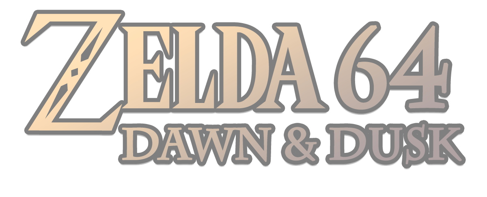

Zelda 64 - Dawn &amp; Dusk is a brand new disk expansion for The Legend of Zelda - Ocarina of Time.

It is **NOT** meant to be a recreation of Ura Zelda or Zelda Gaiden, it has been purposefully made to show off the capabilities of Zelda's 64DD support by **hackers** (this is an important distinction, explained later in this README).

# Credits
 * **Lead Development & Music**
   * Captain Seedy-Eye
 * **64DD Porting**
   * LuigiBlood
 * **Special Thanks to**
   * PK-LOVE
   * BWXIX
   * Hylian Modding (http://hylianmodding.com/)
 * **Testers**
   * Captain Seedy-Eye
   * LuigiBlood
   * Hard4Games
   * ZFG
   * Dry4Haz
   * Fig

# Building

See [BUILDING.md](./doc/BUILDING.md)

# Playing

(Regardless of disk & Zelda ROM region, the expansion will play fully in english. Don't worry about the language barrier.)

See [PLAYING.md](./doc/PLAYING.md)

# The Making of the Disk

## The beginning
This project has been underway since around the beginning of 2018, when a proof of concept was made (https://github.com/LuigiBlood/zeldadisk), based on the research that Zoinkity did for the disk implementation in the original game.

I have been trying to get ways to show this off in a way that's enjoyable, so I have been teaming up with people who could handle the more creative side, which is why the lead developer is actually not me (LuigiBlood) but Captain Seedy-Eye. My only input on the creative side was basically conveying how much content I wanted for such a proof of concept... and tell the lead dev how much I liked it.

I was more interested on the technical side of things and he has done a great job. This was developed first on a Master Quest Debug ROM, for the ease of hacking tools. My job would be then to port all the changes to a 64DD disk, **no matter the hacky tricks I would do.**

## How Zelda handles 64DD integration
**But first, a little technical word on how Zelda handles 64DD, and what Ura Zelda actually is:** Upon starting a disk save file, and not before, the game loads a block of code and callbacks from the disk to initialize the process, and then activates a bunch of traps into the regular game code where if the callback it wants exists, it would call it. The only exception is the scene file loading, handled by the game using a specific byte to tell if the game has to load from disk or not, but most of the time, the loading has to be handled entirely by the disk's code (so, my code).

It just so happens that the default scene list have default information when it comes to load scenes from disk, and **they are most of the dungeons, indicating what Nintendo had planned for since before the game's release, that is, Master Quest.** That said, this Scene List could be replaced (and that's a feature intended by devs), so you can technically replace more scenes.

However the smoking gun is the fact that the minimap loading routine, handles both overworld and dungeon minimaps (they are seperate files), yet **only the dungeon minimaps have an explicit 64DD trap that allows loading from another source.** This means that **Ura Zelda IS Master Quest**, and could be found out by looking at what the original devs intended this for.

You could technically replace almost any game file, but the game had several revisions over its lifetime, making this feature useless as files were changing in addresses and sizes, **effectively rendering impossible most other changes unless you do specific version checks**, which, from a developer standpoint, is just too hacky to be worthwhile if you don't know when you'll stop making newer revisions of the game.

The main problem of this implementation, is that whatever they did, it was set in stone when the first version of the game was finished. It is not future proof. If plans changed, they had to fit in what they already implemented. That said, **Miyamoto did evoke making a special cartridge for this instead...** which was kind of what happened since, and effectively a better way of handling this.

## How WE are handling 64DD integration
However, **we're hackers, and we don't have to care about what Nintendo wanted to do,** and because disk support gives us a free entrypoint to run our own code, this disk has been pulling all sorts of tricks to make this work as close as the original hacked Debug ROM as possible. **Version specific checks, code patching on the fly, loading all the necessary files from the disk AND ROM, patch them and repoint them before the gameplay starts.** That, in a nutshell, are essentially all of the changes made to accomodate to this hack.

And because using 64DD requires the Expansion Pak, we effectively have 4 additional megs of RAM just for this _(except sometimes the game runs code on the extra RAM and puts a framebuffer there for a bit so we have a bit less than that)_. We have used a lot of it, and **we are far above and beyond what Nintendo intended this for.**

I had quite the task of writing all the code in assembly, mostly because I didn't know how to build stuff in C for this exact purpose; but that's okay, I'm not the best assembly coder but I know how to do it. Some experts may laugh at the stupid code I have written.

**I wanted this disk to work on all NTSC revisions of the original game cartridge**, I did not want to hack the ROM, you shouldn't need cheat codes. So I had to face some issues, like the lack of technical documentation for version 1.1 and 1.2, so I had decided to make this fully work on 1.0, and then find ways to port all the changes to the other versions. It turned out that since most of the code is actually identical, porting these changes to 1.1 and 1.2 ended up being more of a breeze than anything, most changes being actually 1:1.

**I also wanted to reuse files from the game instead of supplying already modified files into the disk as much as I could**, mostly to avoid copyright issues and also because it's much more optimized that way, and with all the optimizations in place, **all of the disk data is actually just under 4 MB, and all of the disk code is under 4 KB.**

I'll just say this for any other developer interested: **ALIGN YOUR FILES IN ROM, RAM AND DISK. Preferably 64-bit alignment.** This took ages to debug, about two weeks trying to find the problem that prevented real hardware support, so much so I was worried to release this disk in a state where it only worked for emulators.

## Final thoughts
It turns out that I enjoyed working on this _(...except that real hardware bug)_, from a technical perspective I'd like to think I came out as a more mature low level developer. But this would be my only project for Zelda on Nintendo 64, unless I find more dummy things to do.

I want to give huge thanks to everyone involved in this project, and **I hope you'll enjoy this expansion.** And check out Hylian Modding (http://hylianmodding.com/), they made this expansion possible.

But I really gotta say though, the 64DD integration in Zelda kinda _sucks_. It really seems to be a thing that was done with little thought.

-LuigiBlood
