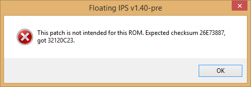

# How to Play

# ROM Version

The ROM version is intended to work on most emulators and flashcarts in the simplest way possible.

There are different patches depending on the ROM you own from the **The Legend of Zelda - Ocarina of Time NTSC cartridge**. It could be either US or Japanese version, and either version 1.0, 1.1 or 1.2. Choose the patch that fits the combination.

Use software like [Floating IPS](https://www.romhacking.net/utilities/1040/) to patch your ROM.

If it is not working, then your ROM might not be in the right format, for that use [Tool64](https://www.zophar.net/utilities/n64aud/tool-n64.html) and change the ROM format to _Big Endian (z64)_ and try again.

**Once patching is done, then load the ROM on your emulator or flashcart of choice like a regular N64 game.**

The save data is not compatible with the Disk version.

## Step-by-step example instructions (US version 1.2, CRC: 32120C23)

1. Obtain a ROM, for demonstration purposes we will use `Legend of Zelda, The - Ocarina of Time (USA) (Rev 2).z64`.
2. Download and open [Floating IPS](https://www.romhacking.net/utilities/1040/).
3. Click **Apply Patch** and select the appropriate patch (in this case `DawnDusk_v2_U_1.2.bps`).
4. Now select the ROM to patch (`Legend of Zelda, The - Ocarina of Time (USA) (Rev 2).z64`).
5. Save the patched rom (`DawnDusk_v2_U_1.2.z64`) anywhere you like.
6. Open the patched rom (`DawnDusk_v2_U_1.2.z64`) in your emulator.

### Dealing with errors

If you get an error similar to this while patching your ROM it means you are using the wrong patch for your ROM, or the wrong ROM for your patch. 

It is also possible that you have the right ROM, but in _Little Endian_ format. You can use [Tool64](https://www.zophar.net/utilities/n64aud/tool-n64.html) to convert your ROM to _Big Endian (z64)_ and try patching again, or obtain a different ROM.

# Disk Expansion

Playing the Disk Expansion may seem a bit daunting, but it's pretty simple, **but to avoid ANY confusion, all details will be mentioned here**, and the instructions here will only mention how to play the disk game on emulator.

## Common Warnings / Requirements

An original **The Legend of Zelda - Ocarina of Time NTSC ROM**, regardless of language and version, is required. **This disk works on version 1.0, 1.1 & 1.2 ROMs.**

Regardless of disk region, **the disk will force the game to use English language instead,** so don't be scared of language barrier.

Any 64DD content (such as IPL) and emulator can be found at https://64dd.org.

 * **Using the Development disk image file _requires_ the following:**
   * ***ANY*** 64DD IPL ROM Image File.
   * ***ANY NTSC cartridge*** Legend of Zelda - Ocarina of Time ROM image.
 * **Using the Japanese disk image file _requires_ the following:**
   * **Japanese Retail** 64DD IPL ROM Image File.
   * **Japanese** Legend of Zelda - Ocarina of Time ROM image (any version).
     * If you have an American ROM, use a hex editor, and change the game ID to `CZLJ`. You do not need to update the checksum.
 * **Using the American disk image file _requires_ the following:**
   * **American Retail** 64DD IPL ROM Image File. (It does exist.)
   * **American** Legend of Zelda - Ocarina of Time ROM image (any version).
     * If you have a Japanese ROM, use a hex editor, and change the game ID to `CZLE`. You do not need to update the checksum.

## Project64

**You need a nightly version of Project64 (2.4.0.1042-ga771022 or newer) for this to work**. You can compile it from [source code](https://github.com/project64/project64).

### Play the Disk Expansion

You can play the disk expansion by doing the following:
 1. Configure the Retail 64DD IPL ROM Path**.
    * Either do it in `Options -> Settings... -> 64DD`.
    * Or load the Retail 64DD IPL ROM image directly in the emulator to configure it automatically.
 2. Load the game.
    * Either do **Load Combo...**, then load the Zelda Ocarina of Time ROM, then the Expansion Disk.
    * Or choose a ROM Directory for the Project64 game list via _File_ then **Choose ROM Directory...** if that's not already done.
      * Right click on Zelda Ocarina of Time on the game list, then select **Play Game with Disk**.
      * **Load the Disk Expansion Image file.**

**The game should launch with "Disk" on the Title Screen.** Make a save file as normal and you can play the game.

### Fix Recompiler Crash

**If the game crashes upon loading a disk save file, please do the following:**

To play the game on Recompiler mode for maximal performance, the following should be setup for the Ocarina of Time ROM:
 * **Edit the original game ROM settings.** There are two ways to access the game settings:
   * Right click on the game on the Game Browser, then click on "Edit Game Settings" (last option).
   * Or launch the game, then on the menu bar, select Options, then Settings... _(or press Ctrl+T shortcut)_, and then select Config tab on the left side.
 * Select the Recompiler tab for the game settings.
 * **Make sure that Protect Memory is checked.**

## mupen64plus

While mupen64plus does provide official support for 64DD emulation, **due to the use of uncached memory code execution to fix severe initial cache loading issues on real hardware,** the emulator will crash with the regular Disk image.

The easy way to fix it would be changing this line of code on ./asm/EZLJ_DISK_Macros.asm, on line 22:
 * `define KSEG1(0xA0000000)` to `define KSEG1(0x00000000)`

Then rebuild the disk, and then use the following command line:
 * `mupen64plus-ui-console.exe --dd-ipl-rom <Retail 64DD IPL ROM Filepath> --dd-disk <Dawn & Dusk Disk Image Filepath> <Zelda Ocarina of Time NTSC ROM Filepath>`
 
**The title screen should show "Disk" if you have done it right,** and then make your save file, and have fun.
